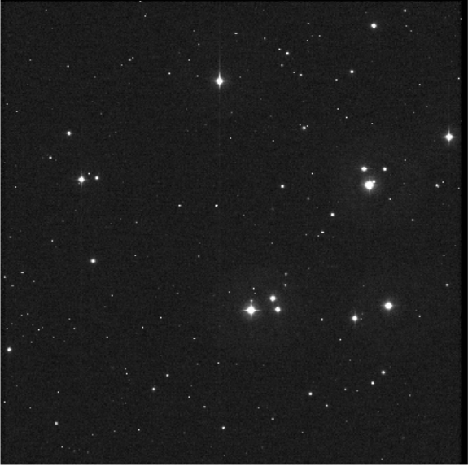
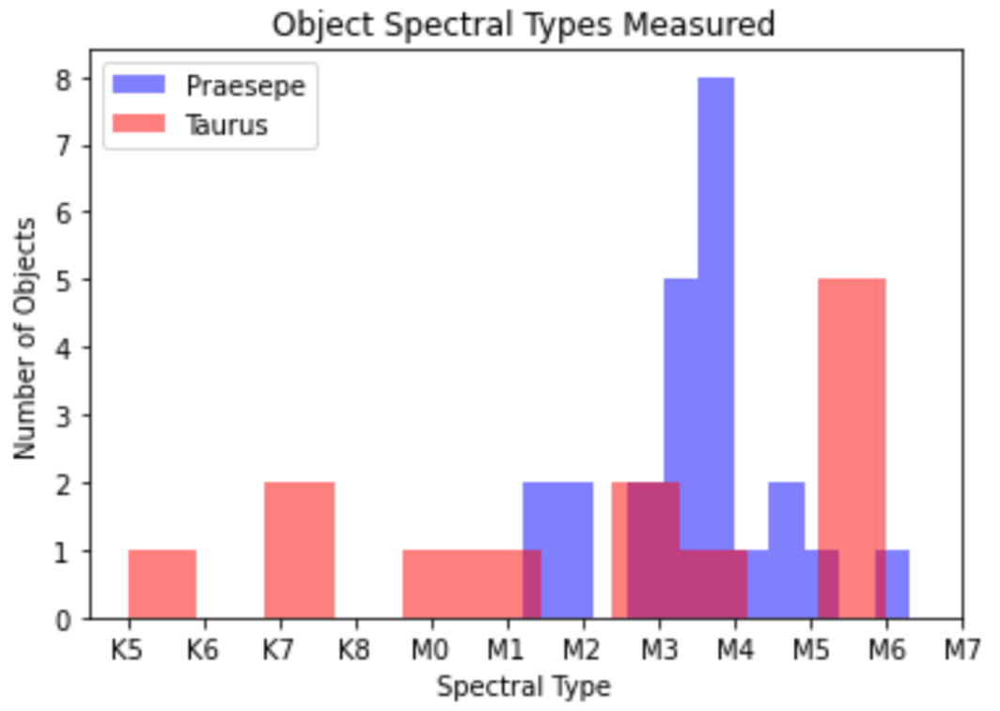
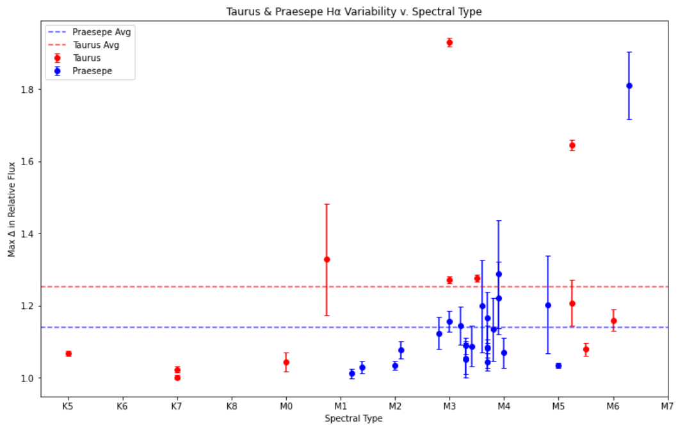
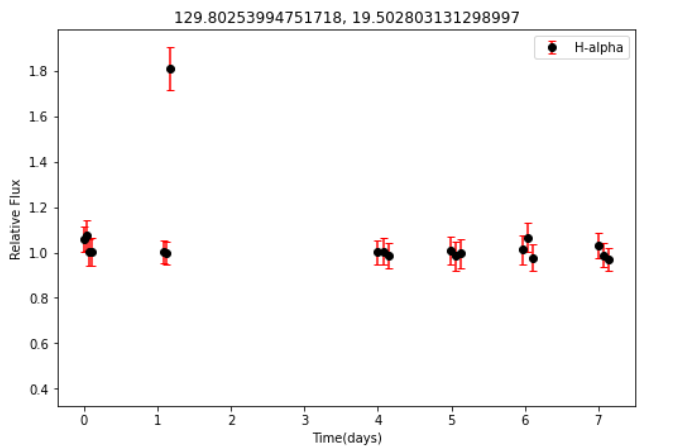
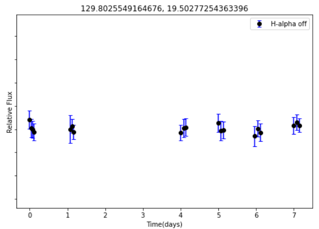
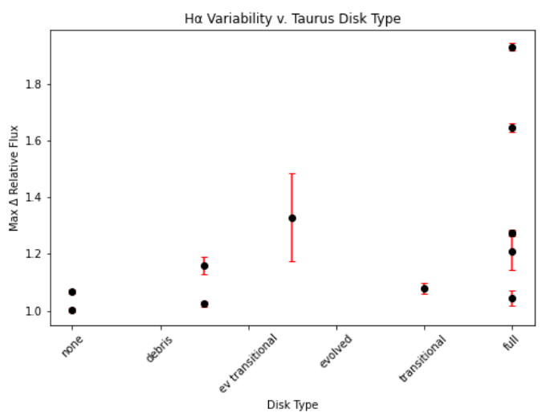

## Optical Astronomy Research

**An investigation into photometric emissions of low-mass stellar objects via observational data from the WIYN 0.9m optical telescope in Kitt Peak, AZ.**

In collaboration with the Astro341 research group at Amherst College, I was invloved in research in which we took photometric images in several wavelengths to provide us with data to study light curves produced by flux variations in Very Low-Mass Objects (VLMO). I analyzed the morphology of such curves and compared objects of different masses, ages, and disk types to deepen our understanding of how stellar and substellar objects in their earliest stages change over time.

The invesigation of this particular topic was explored with my research partner [Savio Oliveira](https://www.linkedin.com/in/savio-oliveira-astro/); I will only be presenting code and writing samples that are my own unless otherwise specified.

I also maintained a research blog throughout this project where I documented my progress which you can find [here](https://mickmaclean.art.blog/) for more insight into my process.

**Tools:** Jupyter/Python (pandas, numpy, matplotlib, photutils, astropy, scipy), Excel, Astrometry, SAOImageDS9 

**Primary skills:** research, data cleaning, data pipeline development, data visualization, data analysis, data management
[341final_poster.pdf](https://github.com/MickMacLean/mickmaclean.github.io/files/8102648/341final_poster.pdf)

### Motivation
Young, low-mass stellar and substellar objects are among the most active and varied objects in the universe and can provide us with information on the early stages of both stellar evolution and planet formation. Clouds of gas and dust collapse under the gravitational pull of a newly formed stellar object, and debris collects and begins to orbit the object as it falls towards the objects surface. Instead of falling directly onto the star, this collected matter flattens and forms a disk around the object in order to preserve angular momentum. This is an *accretion disk*, and many young objects host them until they dissipate around 3Myrs after initial formation. These first few million years of a star’s life tell us how it's initial conditions affect the rest of its evolution as it approaches the main sequence.

The Hα wavelength (665nm) is an indicator of all forms of stellar activity, including chomospheric activity, flares, star spots etc. Hα emissions are correlated to protostellar activity while a nearby wavelength, Hα continuum narrow band or Hα-off (666nm), effectively serves as a controlled way to compare emissions. Both of these are narrow band filters located in the red wavelengths of light, and increased activity should be displayed as an increase in Hα, with no significant change in Hα-off. This comparison rules out any random changes in the flux due to reasons other than accretion or activity, as Hα is the only band that will display significant change in flux for these reasons.

### The Data
The data taken utilized the WIYN 0.9m telescope on Kitt Peak National Observatory with the Half-Degree Imager (HDI), and spans 8 nights from January 19-26, 2020; only 6 nights of data were used due to weather conditions. The regions of space I have analyzed are the Taurus V410 field and the Praesepe cluster, the former, a young star forming region of 1-3Myrs old, and the latter, a cluster of about 600-800Myr old.

These data were taken in the Hα wavelength (665nm) and Hα-off (666nm), and calibration data (bias frames) were taken for each night; every image also contains overscan data, which is a bias adjustment tool for every single image. Our observing run for these regions resulted in over 300 raw files total, expanding to over 1300 files after reduction. 

External data is also taken from the VisieR database in order to identify the known traits of these objects, including coordinates, known magnitudes, and disk types. 

  
  

Fig 1. Final reduced images of our two regions of space, Praesepe (left) and Taurus (right) in Hα.

### Data Reduction
When we take images of space, we must process the raw data prior to analysis. We also superimpose the processed images on top of each other to create a deeper image of our region, allowing us to see deeper into space and view fainter objects more accurately; hundreds of images will result in only a few data points, at least for our investigation into flux changes.

Standard data reduction procedure in optical wavelengths involves a process of bias subtraction, dark current subtraction, flatfielding. Alignment of images

sorting files: hard-coded sorting methods were used, as this is the simplest method to organize the data

Example of Night 1 data reduction process. This is done for all 6 nights of data.

  
View Code

  

### Results

#### Final Data Spread
I successfully extracted relative flux data for 14 objects in Taurus and 19 in Praesepe ranging from M1.2 to K6, which is approximately 0.08SM (solar masses) to 0.75SM (Fig.2 Below).

#### Mass (Spectral Type) & Age Affect on Activity
The maximum change in Ha flux for each night of each object is plotted based on their spectral type.

This plot confirms several key concepts:
- Lower mass objects display higher variable activity on average, having a higher total range of change in flux.

- Younger objects, those in Taurus1, display more activity than older objects in Praesepe. Objects >3Myrs of age have completed their accretion process and are stablized, thus their primary activity will be flares (which I discuss below).

#### Capturing Flare Activity

#### Mass (Spectral Type) vs. Disk Type

For objects in Taurus, I plotted objects from least (no disk) to most (full disk) amount of debris surrounding and subsequently falling onto the surface of the object (external data from Visier).
A more complete disk leads to more accretion and thus more activity, as the range of activity is highest for objects likely to be actively accreting. Accretion is a sporadic process, and thus a range of flux changes is expected.

For more details see [GitHub Flavored Markdown](https://guides.github.com/features/mastering-markdown/).
