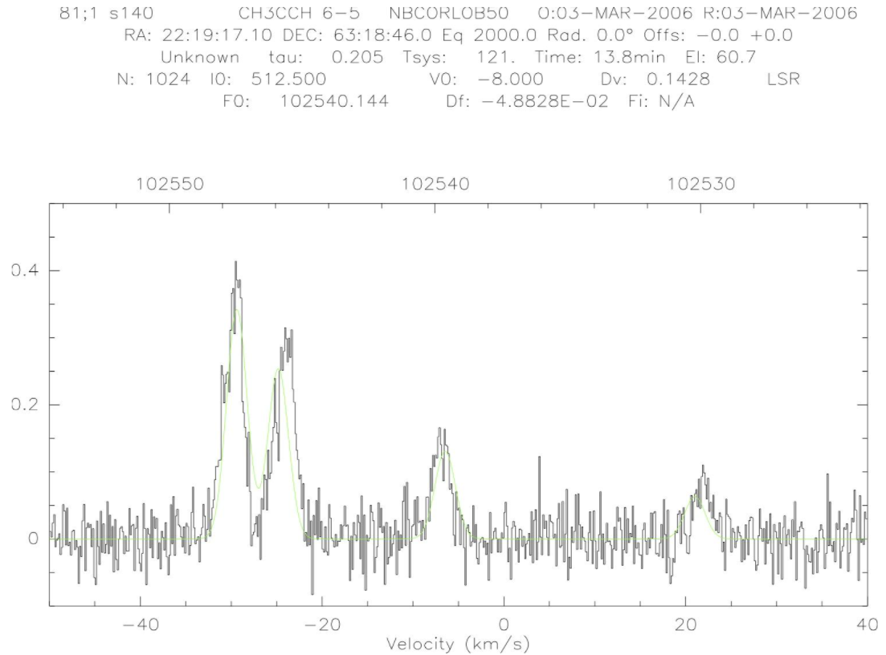

## Radio Astronomy Project
 
**Using rotational transitions of CH₃CCH to confirm the temperature of the S140 gas cloud with previously taken data from the FCRAO telescope in Massachusetts.**

I performed an analysis of data taken during an observation run in 2006 using the now defunct FCRAO telescope in order to determine if the temperature of a molecular gas cloud is consistent with previous studies. 

**tools:** Python (pandas, numpy, matplotlib), IRAM CLASS software package

### Motivation
Methyl Acetylene (CH₃CCH) is a non-linear molecule, needing more than one quantum number in order to describe its angular momentum; CH₃CCH happens to be a symmetric top molecule with 3-fold symmetry that allows its angular momentum to be described with two quantum numbers. The two quantum numbers measure each of the two moments of inertia for CH₃CCH, one of which being the total rotational angular momentum (J), and the other being the rotational angular momentum about the symmetry axis (K).

Electromagnetic radiation can not exert a torque on the molecule along its symmetry axis, and thus EM radiation can not affect the K quantum number. The value of K for the CH₃CCH molecule is only changed by collisions with other molecules, i.e. temperature. A population of CH₃CCH molecules with similar K values are in thermodynamic equilibrium and the population size is only determined by the temperature of the gas. By measuring the different intensities of a change in J for different K-ladders, the intensities can be compared and used to calculate the temperature of the gas cloud these molecules are found in.

The molecular cloud in the S140 region contains a high density of CH₃CCH in equillibrium and by analyzing the intensities of molecular emission lines, the temperature variations within the cloud can be determined and mapped.

### The Data
Data was taken from the core of the S140 gas cloud observing the J = 6 and J = 5 rotational transition of CH₃CCH at 4 different K-ladders (K = 0 to K = 1, K = 2, and K = 3 transitions), and was analyzed using the CLASS software package. I used a gaussian fit to find the intensities for 23 spectra via the four peaks in the data which correspond to each of the k-ladders. These intensities were used to find the ratios between the k-ladder transitions given the previous equations, and thus the temperature.

The above data visualization displays the emission specrum of intensity as a function of frequency (v2) where the four peaks are the k-ladder emissions. The Gaussian fit is (faintly) displayed in green to show the fit. This data is displayed within the CLASS software package.

### Results & Weighted Corrections
Using a Gaussian fit, 70% of the data fit within one standard deviation. Data points that were discarded were replaced with the mean value of all other points, and the uncertainties were found similarly using the mean uncertainties. More accurately weighted values would be ideal, but it is difficult to perform these due to the nature of the data. However, the mean & median of the raw data are very similar, implying that outliers have not skewed our data even before error analysis. The average temperature of the cloud was determined to be 26.68 ± 5.84K where the uncertainty is one standard deviation. 
The raw data temperatures are mapped based on the coordinates from the original data below.

After replacing values we have the temperature map as follows:

The known value given by the study,,,, is 30, which is within one standard deviation of my results. The small concentration of warmer temperatures to the bottom left of the temperature map is consistent with a cloud core, a denser region of molecules within the cloud. 
