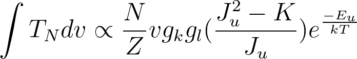

## Radio Astronomy Project
 
**Using rotational transitions of CH₃CCH to confirm the temperature of the S140 gas cloud with previously taken data from the FCRAO telescope in Massachusetts.**

I analyzed data taken during an observation run in 2006 using the now defunct FCRAO telescope in order to determine if the temperature of a molecular gas cloud is consistent with previous studies. 

**tools:** Python (pandas, numpy, matplotlib), IRAM CLASS software package

### Motivation
Methyl Acetylene (CH₃CCH) is a non-linear molecule, needing more than one quantum number in order to describe its angular momentum; CH₃CCH happens to be a symmetric top molecule and has a 3-fold symmetry that allows its angular momentum to be described with two quantum numbers. The two quantum numbers measure each of the two moments of inertia for CH₃CCH, one of which being the total rotational angular momentum (J), and the other being the rotational angular momentum about the symmetry axis (K).
When K = 0, the molecule will not be rotating about the symmetry axis at all and when K = J, all of the molecules rotational angular momentum will be about its symmetry axis.

The dipole moment for CH₃CCH is along the symmetry axis which means that electromagnetic radiation can not exert a torque on the molecule along that axis. This means that EM radiation can not affect the K quantum number and the value of K for the CH₃CCH molecule is only changed by collisions with other molecules, i.e. temperature. A population of  CH₃CCH molecules with similar K values are in thermodynamic equilibrium and the population size is only determined by the temperature of the gas. By measuring the different intensities of a change in J for different K-ladders, the intensities can be compared and used to calculate the temperature of the gas cloud these molecules are found in.

The molecular cloud in the S140 region contains a high density of CH₃CCH and by analyzing the intensities of moleculare emission lines, the temperature variations within the cloud can be determined.
This experiment uses data gathered from the core of gas cloud S140 and looks at the J = 6 to J = 5 transition of CH₃CCH at four different K-ladders

### The Data
Data was taken from the core of the S140 gas cloud and looks at the J = 6  and J = 5 rotational transition of CH₃CCH at 4 different K-ladders (K = 0 to    K = 1, K = 2, and K = 3 transitions).
Used a gaussian fit to fit the data
Found the intensities for 23 of the spectra, which had a good fit to clearly show the four peaks in the data
The intensities of the spectra were used to find the ratios between the K = 0 to K = 1, K = 2, and K = 3 transitions
The ratios were used to find the values of temperature

Spectra analysis; analyze the intensity vs velocity spectra
4 peaks correspond to k-ladders, find value from peak

### Results & Weighted Corrections
Using a Gaussian fit, the standard deviation discarded 30% of the data. Data points that were discarded were replaced with the mean value of all other points, and the uncertainties were found similarly. Mean & median very similar --- implies outliers have not skewed our data, even before error analysis
Any values outside the stdev discarded

The raw data is displayed below.

After replacing values we have the temperature map as follows:

  
  

The average temperature of the cloud was found to be 27. Comparing this to the known value of 30; 30 is within one standard deviation of our results.
The small concentration of warmer temperatures is a cloud core, a denser region of molecules.
