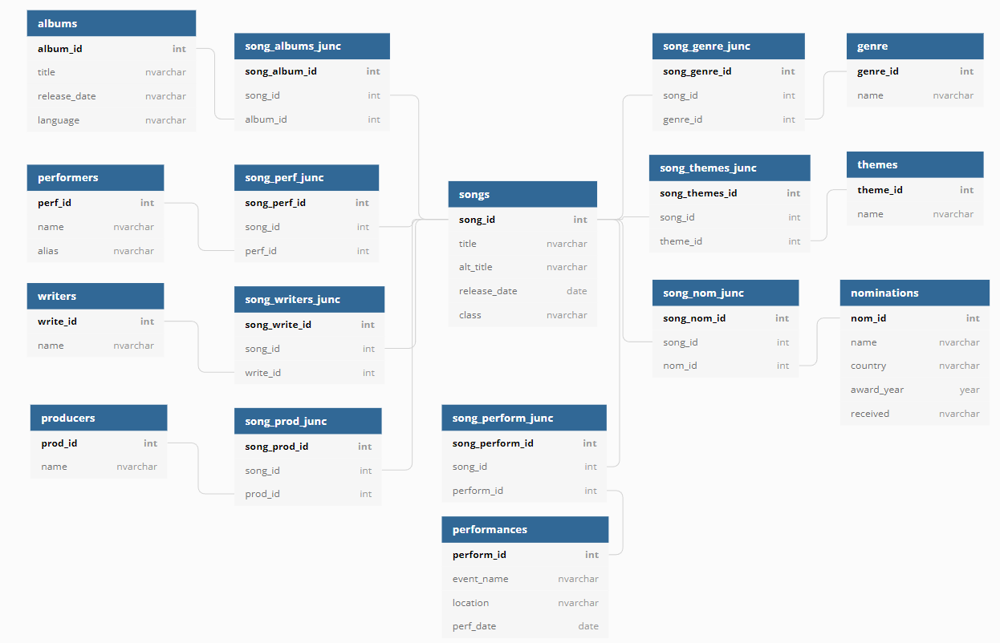
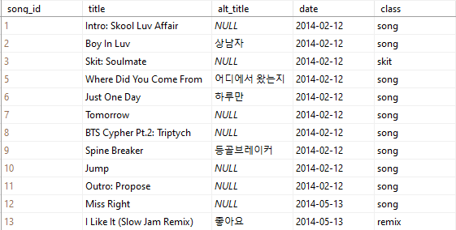

## BTS Database Project

### Project at a glance
**Construct a database with data on every BTS song such that the data will be in an easily comparable format.** 

방탄소년단, Bangtan Sonyeondan, also known as BTS, is a South Korean boyband under Big Hit Entertainment whose extensive and diverse discography has garnered them a plethora of awards and millions of passionate fans dedicated to their socially-conscious music. 

With over 350 songs, their discography presents a prime opportunity to explore various data and its trends.

#### Project Goals
As an avid fan interested in understanding their music lyrically and emotionally, and as someone interested in analytics, I decided to gather data and construct a database that contains information cateloging their entire discography: all BTS albums, singles, and solo projects not released under the band's name. My main goals are as follows:
- construct a database to store data in an easily comparable format, serves as an encyclopedia of information
- provide a simple way to compare the stats of each song, category, and query based on categories of interest

Longer-term, I plan on implementing this database into a user-friendly website for fans to access and use for their own purposes.

**Tools:** SQL, Excel

**Primary skills:** data collection, data management, databases development & management 
  
### Structure
The overall focus of this data is information pertaining to the songs themselves, and as a result I have centered the structure of this database around songs. This results in a lot of intermediary tables, as every category of data invloves a many-to-many relationship with respect to the songs. 

 

I am currently testing this structure with a small portion of the data to ensure it results in a structure beneficial to my goals. This project is in its early stages of development and changes to the structure, data types, etc. are likely.

### The Data
Much of this data must be collected manually as there is no central site containing all of the data to be included. Data currently taken from Korea Music Copyright Assosiation (KOMCA), Genius, and the official Spotify and YouTube of BTS.

The data categories to be included are as follows (click any category for further description):

 
   
 Songs 

There are over 350 songs to be included in this database, taking into consideration all original published singles and albums, remixes, and solo projects created by the members outside of BTS. This table contains the columns title, alternate title, release date, and class.

  
  
Many songs have multiple titles depending on the language and translation; the song "뱁새" ("Baepsae") for example, can also be called "Crow-Tit", "Try-Hard", or "Silver Spoon" due to the many translations and transliterations of the Korean title. I will use the most common title and translations where necessary, but I may add a table for alternate titles in the future.

 
  
Some songs have a remix (or several) which changes the overall genre of the original song, as well as having a different release date. I considered making remixes their own separate table with another many to many relationship, but I decided to use a classification column within songs instead. Then I can still sort by class to find all remixes, or by title to find all remixes of a song/to see if a song has a remix. The "class" column is this classification where there are three potential types of tracks: song (a traditional original song), skit (a spoken word track, usually featuring a conversation between the members), and remix (a remix of an original song).
  
 
  
Current songlist:
  
 
  

  
 

Songs frequently appear on multiple albums (and albums contain multiple songs, of course) so a many-to-many relationship is required between songs and albums.

 
  
 Albums 

This table contains the columns title, release date, and language. There are 32 official albums created by BTS: 17 where the primary language is Korean, 14 in Japanese, and 1 in English. Non-BTS albums to be included are not yet on this table. 
  
   
  
Current album list:
  
   
  

 
   
 Performers, Writers, & Producers 

  
These are three separate tables which contain the names of the performers, writers, and producers who worked on each song.

   
  
  While the band has 7 members, not all are featured on every song; units such as the rap-line and vocal-line, as well as other random groupings, solos, and separate artist features are common on most albums. This 'Performers' table lists with the 7 members, then artists commonly featured (usually people from within the company), then external features or artists not commonly featured on these albums. 

   
  
The writers and producers overlap substantially (with the performers, too) so there is potential for turning these three into one table. However, the intermediary table would likely end up being large with the possibility of 20 attributes per song, so for now I have opted to keep them as separate tables.

 
   
 Choreographers 
 
  
Many songs, particularly title tracks, have choreography and I would like to credit those involved, but it is surprisingly difficult to find this information from a reliable source (if at all). I have decided to leave this information out until a reliable source can be found, but it is still data I would like to eventually pursue.

 
   
 Genres 
 
  
While the whole of BTS's discography, especially when considered in contexts with other artists, is classified as 'KPOP' with secondary genres like 'hip-hop' or 'dance pop', their music has a variety of influences that are important to distinguish when we consider BTS as their own entity. I could simplify the relationships by having only one primary genre per song, but this wouldn't encapsulate the diversity within BTS's music, and also wouldn't allow for accuracy when comparing songs. 
 
This categorization is a bit subjective but I will be thoroughly researching to make in-depth analysis of each song, and will be asking others for their input via social media.

 
   
 Themes 
 
  
This is another subjective categorization which describes the overall motifs within each song. Songs will have more than one in general due to the complex themes and lyricism, as well as for ease of comparison.

 
   
 Awards 
 
  
Many songs have been nominated for awards across several countries, spanning from the Melon Music Awards in South Korea to the Grammy Awards in the United States.
This table includes the columns 'name' for the name of the award, 'country', 'award year', and 'received' to confirm whether the award was received or not.

 

 
   
 Performances 
 
  
For this category, I would like to know where and when each song has been performed live for fans on tours, concerts, award shows, and other events. There are many songs which have never been performed live and I want to be able to differentiate these, as well as see how often they perform certain songs. Sifting through nearly 10 years of information is going to take a while, so this category is on hold while I work on the more directly available data.

The small portion of data I am currently working with spans two albums, Skool Luv Affair and Skool Luv Affair: Special Addition, choosen due to their overlap and feature of both a skit and remix, can be seen below.

**Current song list:**

**Current album list:**

