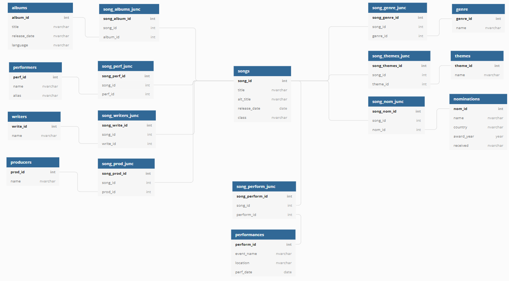
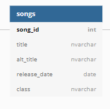
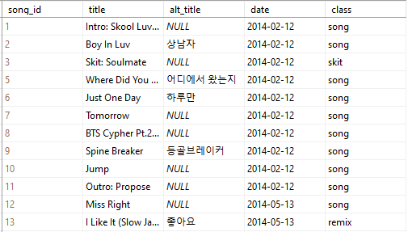
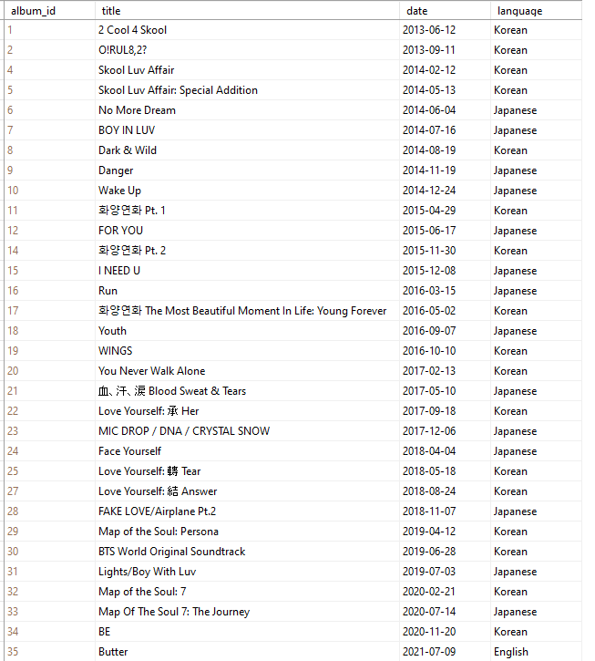

## BTS Database Project

### Project at a glance
**Construct a database with data on every BTS song such that the data will be in an easily comparable format.** 

방탄소년단, Bangtan Sonyeondan, also known as BTS, is a South Korean boyband under Big Hit Entertainment whose extensive and diverse discography has garnered them a plethora of awards and millions of passionate fans dedicated to their socially-conscious music. 

With over 350 songs, their discography presents a prime opportunity to explore various data and its trends.

#### Project Goals
As an avid fan interested in understanding their music lyrically and emotionally, and as someone interested in analytics, I decided to gather data and construct a database that contains information cateloging their entire discography: all BTS albums, singles, and solo projects not released under the band's name. My main goals are as follows:
- construct a database to store data in an easily comparable format, serves as an encyclopedia of information
- provide a simple way to compare the stats of each song, category, and query based on categories of interest

Longer-term, I plan on implementing this database into a user-friendly website for fans to access and use for their own purposes.

**Tools:** SQL, Excel

**Primary skills:** data collection, data management, databases, 
  
 ### Structure
The overall focus of this data is information pertaining to the songs themselves, and as a result I have centered the structure of this database around songs. This results in a lot of intermediary tables, as every category of data invloves a many-to-many relationship with respect to the songs. 

 

I am currently testing this structure with a small portion of the data to ensure it results in a structure beneficial to my goals. This project is in its early stages of development and changes to the structure, data types, etc. are likely.

### The Data
Much of this data must be collected manually as there is no central site containing all of the data to be included. Data currently taken from Korea Music Copyright Assosiation (KOMCA), Genius, and the official Spotify and YouTube of BTS.

The data categories to be included are as follows (click any category for further description):

 
   
 Songs 

There are over 350 songs under BTS's name, including all original published singles and albums, remixes, and solo projects created by the members separate from BTS. 

  
- Many songs have multiple titles depending on the language and translation; the song "뱁새" ("Baepsae") for example, can also be called "Crow-Tit", "Try-Hard", or "Silver Spoon" due to the many translations and transliterations of the Korean title. I will use the most common title and translations where necessary, but I may add a table for alternate titles in the future.
- Songs frequently appear on multiple albums (and albums contain multiple songs, of course) so a many to many relationship is required between songs and albums.

- Some songs have a remix (or several) which changes the overall genre of the original song, as well as having a different release date. I considered making remixes their own separate table with another many to many relationship, but I decided to use a classification column within songs instead. Then I can still sort by class to find all remixes, or by title to find all remixes of a song/to see if a song has a remix. The "class" column is this classification where there are three potential types of tracks: song (a traditional original song), skit (a spoken word track, usually featuring a conversation between the members), and remix (a remix of an original song).

The small portion of data I am currently working with spans two albums, Skool Luv Affair and Skool Luv Affair: Special Addition, choosen due to their overlap and feature of both a skit and remix, can be seen below.

 
  
 Albums 

There are 32 official albums created by BTS: 17 where the primary language is Korean, 14 in Japanese, and 1 in English. Non-BTS albums to be included are not yet on this table.
Repackaged and compilation albums are common within this discogrpahy, so songs are frequently shared between several albums.
  

 
   
 Performers, Writers, & Producers 

  
While the band has 7 members, not all are featured on every song; units such as rap-line and vocal-line, as well as other random groupings, solos, and separate artist features are common on most albums. 
This table begins with the 7 members, then common features (usually from within the company), then external features. 

The writers and producers overlap substantially (with the performers as well) so there is potential for turning these 3 into one table. However, the intermediary table would likely end up being very large with the possibility of 20 attributes per song, so for now they are separate tables.

 
   
 Choreographers 
 
  
Many songs have choreography and i would like to credit those involved, but it is surprisingly difficult to find this information so it has been left out until I can find a reliable source.

 
   
 Genres 
 
  
While the whole of bts' discography, especially when considered in contexts with other artists, is classified as kpop and sometimes hip-hop, dance pop, etc., their music has a variety of influences that are important for me to distinguish. Thus categorization is a bit subjective and given my lack of music genre knowledge, I will be asking others for their input via social media.
I could simplify this by having only one primary genre per song, but this wouldn't encapsulate the variety of influences within BTS's music, and also wouldn't allow for accurate search results when looking for or comparing songs.

 
   
 Themes 
 
  
This is another subjective categorization which describes the overall motifs within each song. Songs will have more than one in general due to the complex themes and lyricism, as well as for ease of comparison.

 
   
 Awards 
 
  
Many songs, especially title tracks, have been nominated for awards across several countries from the Melon Music Awards in Korea to the Grammies in the US.
songs nominated for awards in several countries by different academies, whether the award was received 

 

 
   
 Performances 
 
  
I would like to know where and when each song has been performed live for fans on tours, concerts, award shows, and other events. There are many songs which have never been performed live and I want to be able to differentiate these, as well as see how often they perform certain songs. Sifting through nearly 10 years of information is going to take a while, so this category is on hold while I work on others.

