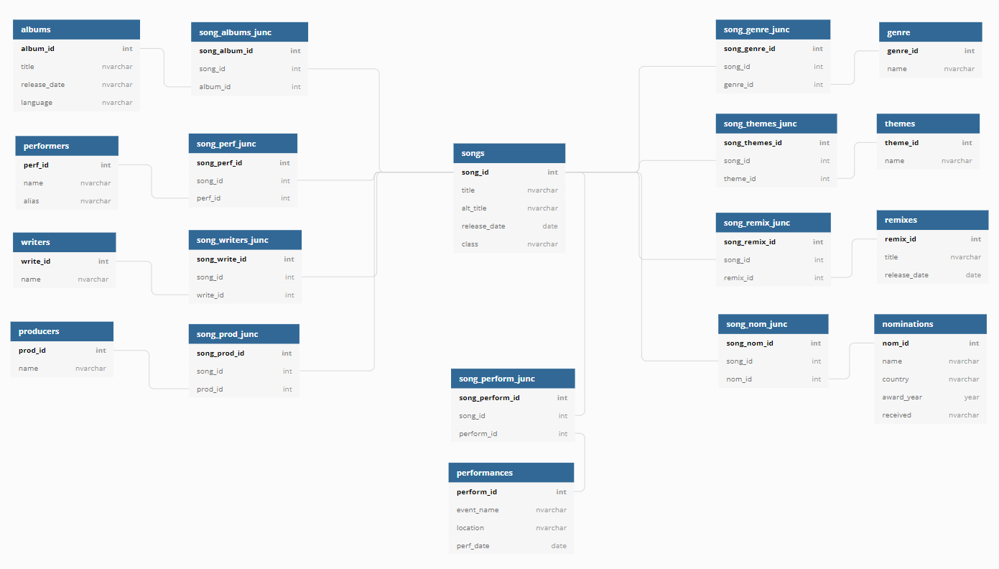

## BTS Database Project

### Project at a glance
**Construct a database with data on every BTS song such that the data will be in an easily comparable format.** 

방탄소년단, Bangtan Sonyeondan, also known as BTS, is a South Korean boyband under Big Hit Entertainment whose extensive and diverse discography has garnered them a plethora of awards and millions of passionate fans dedicated to their socially-conscious music. 

With over 350 songs, their discography presents a prime opportunity to collect and explore data and its trends further.

As an avid fan myself, I am interested in understanding their music lyrically and emotionally, and as someone passionate about data, I'm interested in the analytics of their music. My main goal is to construct a database where I can store data in an easily comparable format to serve as an encyclopedia of information, as well as provide a simple way to compare the stats of each song, category, and query based on tags.
Construct a user-friendly website to display these data for fans to access and use for their own purposes.
Want data in an easily comparable format, serve as an encyclopedia of information.

**Tools:** SQL, Excel

**Primary skills:** data collection, data management, databases, 
  
 ### Structure
 The overall focus of this data is with respect to the songs themselves, and as a result I have focused the structure of this database around the songs. This results in a lot of intermediary tables due to every category of data being a many to many relationship of each category to the songs. I am currently testing this structure with a small portion of the data
 

This project is in its early stages of development.

### The Data
Much of this data must be collected manually as there is no central site which contains all of the data to be included. Data currently taken from Korea Music Copyright Assosiation (KOMCA), Genius, Hypable, and the official Spotify and YouTube of the band.
Example dataset with information; one album of information is displayed below.

The data to be included for each song is as follows:

#### Songs
many songs have multiple titles depending on the language and translation chosen eg Baepsae can be called crow tit, try hard, silver spoon etc.
Songs frequently appear on multiple albums.

some songs have multiple remixes which change the overall genre of the original song, as well as having a different release date. Remixes don't have to be a table, could be fine within songs as I have the classification column? Then we could still sort by class to find all Remixes, or by title to find all Remixes of a song/ to see if a song has a remix 

#### Albums
There are 32 albums, x where the primary language is Korean, x Japanese, and 1 in English. There are many songs on each album, but there are also many repackaged and compilation albums which share songs between them.

#### Writers, Producers, & Performers
While the band has 7 members, not all are featured on every song; units such as rap-line and vocal-line, as well as other random groupings, solos, and separate artist features are common on most albums. 
This table begins with the 7 members, then common features (usually from within the company), then external features. 

The writers and producers overlap substantially (with the performers as well) so there is potential for turning these 3 into one table. However, the intermediary table would likely end up being very large with the possibility of 20 attributes per song, so for now they are separate tables.

#### Choreographers 
Many songs have choreography and i would like to credit those involved, but it is surprisingly difficult to find this information so it has been left out until I can find a reliable source.

#### Genres
While the whole of bts' discography, especially when considered in contexts with other artists, is classified as kpop and sometimes hip-hop, dance pop, etc., their music has a variety of influences that are important for me to distinguish. Thus categorization is a bit subjective and given my lack of music genre knowledge, I will be asking others for their input via social media.
I could simplify this by having only one primary genre per song, but this wouldn't encapsulate the variety of influences within BTS's music, and also wouldn't allow for accurate search results when looking for or comparing songs.

#### Themes
This is another subjective categorization which describes the overall motifs within each song. Songs will have more than one in general due to the complex themes and lyricism, as well as for ease of comparison.

#### Awards
Many songs, especially title tracks, have been nominated for awards across several countries from the Melon Music Awards in Korea to the Grammies in the US.
songs nominated for awards in several countries by different academies, whether the award was received 
 
#### Performances
I would like to know where and when each song has been performed live for fans on tours, concerts, award shows, and other events. There are many songs which have never been performed live and I want to be able to differentiate these, as well as see how often they perform certain songs. Sifting through nearly 10 years of information is going to take a while, so this category is on hold while I work on others.
